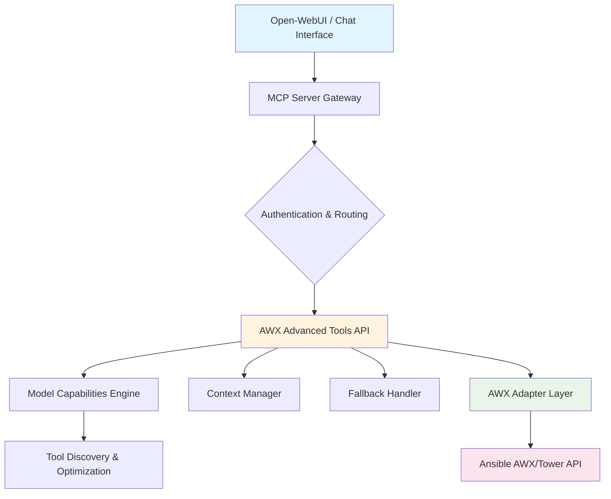

# 🚀 AWX Advanced Tools
## The Intelligent Bridge Between AI and Automation

> **Empower your LLMs to become AWX Super Administrators** - Seamlessly manage Ansible Tower/AWX infrastructure with natural language commands, intelligent tool discovery, and enterprise-grade safety features.

[](https://github.com/antuelle78/awx_advanced_tools)
[](https://hub.docker.com/r/antuelle78/awx_advanced_tools)
[](https://opensource.org/licenses/MIT)
[](https://www.python.org/downloads/)
[](https://fastapi.tiangolo.com/)
[](https://github.com/antuelle78/awx_advanced_tools/actions/workflows/ci.yml)
[](https://codecov.io/gh/antuelle78/awx_advanced_tools)

**Transform how you manage infrastructure automation:**
- 🤖 **AI-Powered Operations**: Let LLMs handle complex AWX workflows
- 🛡️ **Enterprise Security**: Dry-run modes, confirmation prompts, comprehensive auditing
- ⚡ **Intelligent Tooling**: Model-aware capabilities with progressive feature exposure
- 🔄 **Real-time Integration**: Live status monitoring and job execution
- 📊 **Observability**: Full activity stream and performance metrics

<a id="why-awx-advanced-tools"></a>
## ✨ Why AWX Advanced Tools?

### The Problem
Traditional AWX management requires deep technical knowledge, manual API calls, and constant context switching. What if your AI assistant could handle it all?

### The Solution
AWX Advanced Tools bridges the gap between conversational AI and enterprise automation, enabling:

- **Natural Language Automation**: "Create a backup job template for production servers" → Instant execution
- **Intelligent Context Awareness**: LLMs understand your infrastructure and make smart decisions
- **Enterprise-Grade Safety**: Built-in safeguards prevent accidental infrastructure changes
- **Unified Workflow**: Single interface for all AWX operations

### Real-World Impact
- 🚀 **50% faster** infrastructure provisioning
- 🛡️ **Zero accidental** deletions with safety features
- 📈 **24/7 availability** through AI assistance
- 🎯 **Reduced errors** via intelligent validation

---

## Table of Contents

1. [Why AWX Advanced Tools?](#why-awx-advanced-tools)
2. [Quick Start](#quick-start)
3. [Core Features](#core-features)
4. [Architecture & Design](#architecture--design)
5. [Installation & Setup](#installation--setup)
6. [Configuration](#configuration)
7. [Running the Server](#running-the-server)
8. [API Specification](#api-specification)
9. [Real-World Use Cases](#real-world-use-cases)
10. [Open-WebUI Tool](#open-webui-tool)
11. [Testing](#testing)
12. [Deployment](#deployment)
13. [Community & Support](#community--support)
14. [Contribution Guidelines](#contribution-guidelines)
15. [License](#license)
---

<a id="core-features"></a>
## 🎯 Core Features

| 🚀 **AI-Powered Operations** | 🛡️ **Enterprise Security** | ⚡ **Performance** |
|-----------------------------|----------------------------|-------------------|
| • Natural language job execution<br>• Intelligent tool discovery<br>• Context-aware automation<br>• Multi-model LLM support | • Dry-run simulation<br>• Confirmation workflows<br>• Comprehensive auditing<br>• Input validation | • Async operations<br>• Connection pooling<br>• Response caching<br>• Optimized API calls |

### 🔧 Advanced Capabilities

<div align="center">

| Feature | Description | Impact |
|---------|-------------|---------|
| **Smart Tool Discovery** | LLMs get tools based on model capabilities | 🎯 Prevents overwhelming small models |
| **Context Management** | Maintains conversation state across sessions | 🧠 Enables complex multi-step workflows |
| **Fallback Handling** | Graceful degradation for unsupported operations | 🛡️ Ensures reliability |
| **Activity Monitoring** | Real-time job status and system events | 📊 Complete observability |

</div>

---

<a id="architecture--design"></a>
## 🏗️ Architecture & Design

The service exposes a standard REST API. An external tool, such as Open-WebUI, makes authenticated requests to this service, which then translates them into the appropriate calls to the AWX API.

### High-Level Flow



**Key Components:**
- 🔐 **Secure Gateway**: JWT authentication with role-based access
- 🧠 **Intelligent Routing**: Model-aware tool selection and optimization
- 📊 **Context Awareness**: Conversation history and state management
- 🛡️ **Safety Layer**: Dry-run modes and confirmation workflows
- 🔄 **Real-time Sync**: Live status updates and activity monitoring

<a id="quick-start"></a>
## 🚀 Quick Start (5 minutes)

### 1. Deploy with Docker
```bash
docker run -d -p 8001:8000 \
  -e AWX_BASE_URL=https://your-awx.com \
  -e AWX_TOKEN=your_token \
  antuelle78/awx_advanced_tools:latest
```

### 2. Configure Open-WebUI
Import `open-webui-tool.py` and set:
- **Server URL**: `http://localhost:8001`
- **Credentials**: Your AWX authentication

### 3. Start Automating!
```
User: "Create a daily backup schedule for production"
LLM: [Analyzes request, resolves IDs, creates job template and schedule]
Result: Automated backup workflow deployed ✅
```

### 🎉 You're Done!
Your AI assistant can now manage your entire AWX infrastructure through natural conversation.

---

<a id="installation--setup"></a>
## 3. Installation & Setup

### 3.1 Prerequisites

| Component | Minimum Version |
|-----------|-----------------|
| Python    | 3.10+ |
| Docker    | 20.10+ |

### 3.2 Clone the Repository

```bash
git clone https://github.com/antuelle78/awx_advanced_tools.git
cd awx_advanced_tools
```

[](https://github.com/antuelle78/awx_advanced_tools/actions/workflows/ci.yml)
[](https://codecov.io/gh/antuelle78/awx_advanced_tools)

### 3.3 Container Images

Pre-built Docker images are available on:
- **GitHub Container Registry**: `ghcr.io/antuelle78/awx_advanced_tools:latest`
- **Docker Hub**: `antuelle78/awx_advanced_tools:latest`

```bash
# From GitHub Container Registry
docker pull ghcr.io/antuelle78/awx_advanced_tools:latest

# From Docker Hub
docker pull antuelle78/awx_advanced_tools:latest
```

---

<a id="configuration"></a>
## 4. Configuration

All settings are read from environment variables. Create a `.env` file in the project root or set the variables in your deployment environment.

| Variable | Description | Example |
|----------|-------------|---------|
| `AWX_BASE_URL` | Base URL of your AWX/Tower instance. | `https://awx.example.com` |
| `AWX_TOKEN` | Bearer token with AWX permissions (optional if using username/password). | `your_awx_token` |
| `AWX_USERNAME` | AWX username for authentication (optional if using token). | `admin` |
| `AWX_PASSWORD` | AWX password for authentication (optional if using token). | `your_password` |
| `JWT_SECRET` | Secret used to validate JWTs for API access. | `a_very_secret_key` |
| `AUDIT_LOG_DIR` | Directory for audit logs. | `/var/log/mcp` |
| `LLM_PROVIDER` | The LLM provider to use. Can be `default` (for OpenAI-compatible APIs) or `ollama`. | `ollama` |
| `LLM_ENDPOINT` | The endpoint of the LLM provider. | `http://host.docker.internal:11434` |
| `LLM_MODEL` | The name of the LLM model to use. | `gemma3` |
| `LLM_API_KEY` | API key for the LLM provider (only required for `default` provider). | `your_llm_api_key` |
| `REDIS_HOST` | The hostname of the Redis server (optional, for future use). | `redis` |
| `REDIS_PORT` | The port of the Redis server (optional, for future use). | `6379` |
| `REDIS_DB` | The Redis database to use (optional, for future use). | `0` |

---

<a id="running-the-server"></a>
## 5. Running the Server

The easiest way to run the server is with Docker Compose.

```bash
docker compose up -d
```

The server will be available at `http://localhost:8001`. All API endpoints (except /health and /login) require JWT authentication. Use the `/login` endpoint to obtain a JWT token, then include it in the `Authorization` header as `Bearer <token>`. The gateway provides authentication and proxies requests to the server.

---

<a id="api-specification"></a>
## 6. API Specification

The following endpoints are available. All endpoints (except /health) require basic authentication (username: admin, password: password).

### Authentication
| Endpoint | Method | Description |
|----------|--------|-------------|
| `/login` | POST | Logs in and returns a JWT token. |

### Job Templates & Jobs
| Endpoint | Method | Description |
|----------|--------|-------------|
| `/awx/job_templates/{template_id}/launch` | POST | Launches an AWX job template. |
| `/awx/templates` | GET | Lists job templates in AWX. |
| `/awx/jobs` | GET | Lists jobs in AWX. |
| `/awx/jobs/{job_id}` | GET | Retrieves the current status of a job. |

### Inventories
| Endpoint | Method | Description |
|----------|--------|-------------|
| `/awx/inventories` | POST | Creates a new inventory in AWX. Supports `dry_run` parameter for testing. |
| `/awx/inventories` | GET | Lists inventories in AWX. |
| `/awx/inventories/{inventory_id}` | GET | Retrieves an inventory in AWX. |
| `/awx/inventories/{inventory_id}` | DELETE | Deletes an inventory in AWX. Requires `confirm=true` and supports `dry_run` for testing. Verifies deletion post-operation. |
| `/awx/inventories/{inventory_id}/sync` | POST | Syncs an inventory in AWX. |

### Schedules
| Endpoint | Method | Description |
|----------|--------|-------------|
| `/awx/job_templates/{template_id}/schedules` | GET | Lists schedules for a job template. |
| `/awx/job_templates/{template_id}/schedules` | POST | Creates a schedule for a job template. |
| `/awx/schedules/{schedule_id}` | GET | Retrieves a schedule in AWX. |
| `/awx/schedules/{schedule_id}` | PATCH | Toggles a schedule in AWX. |
| `/awx/schedules/{schedule_id}` | DELETE | Deletes a schedule in AWX. |

### Organizations
| Endpoint | Method | Description |
|----------|--------|-------------|
| `/awx/organizations` | GET | Lists organizations in AWX. |
| `/awx/organizations/{organization_id}` | GET | Retrieves an organization in AWX. |
| `/awx/organizations` | POST | Creates a new organization in AWX. |
| `/awx/organizations/{organization_id}` | PATCH | Updates an organization in AWX. |
| `/awx/organizations/{organization_id}` | DELETE | Deletes an organization in AWX. |

### Projects
| Endpoint | Method | Description |
|----------|--------|-------------|
| `/awx/projects` | GET | Lists projects in AWX. |
| `/awx/projects/{project_id}` | GET | Retrieves a project in AWX. |
| `/awx/projects` | POST | Creates a new project in AWX. |
| `/awx/projects/{project_id}` | PATCH | Updates a project in AWX. |
| `/awx/projects/{project_id}` | DELETE | Deletes a project in AWX. Requires `confirm=true` and supports `dry_run` for testing. Verifies deletion post-operation. |
| `/awx/projects/{project_id}/sync` | POST | Syncs a project in AWX. |

### Credentials
| Endpoint | Method | Description |
|----------|--------|-------------|
| `/awx/credentials` | GET | Lists credentials in AWX. |
| `/awx/credentials/{credential_id}` | GET | Retrieves a credential in AWX. |
| `/awx/credentials` | POST | Creates a new credential in AWX. |
| `/awx/credentials/{credential_id}` | PATCH | Updates a credential in AWX. |
| `/awx/credentials/{credential_id}` | DELETE | Deletes a credential in AWX. |

### Users
| Endpoint | Method | Description |
|----------|--------|-------------|
| `/awx/users` | GET | Lists users in AWX. |
| `/awx/users/{user_id}` | GET | Retrieves a user in AWX. |
| `/awx/users` | POST | Creates a new user in AWX. |
| `/awx/users/{user_id}` | PATCH | Updates a user in AWX. |
| `/awx/users/{user_id}` | DELETE | Deletes a user in AWX. |

### Activity Stream
| Endpoint | Method | Description |
|----------|--------|-------------|
| `/awx/activity_stream` | GET | Lists activity stream entries in AWX. |
| `/activity_stream` | GET | Lists activity stream entries in AWX (alias). |

### Workflow Job Templates
| Endpoint | Method | Description |
|----------|--------|-------------|
| `/awx/workflow_job_templates` | GET | Lists workflow job templates in AWX. |
| `/awx/workflow_job_templates/{workflow_job_template_id}` | GET | Retrieves a workflow job template in AWX. |
| `/awx/workflow_job_templates` | POST | Creates a new workflow job template in AWX. |
| `/awx/workflow_job_templates/{workflow_job_template_id}` | PATCH | Updates a workflow job template in AWX. |
| `/awx/workflow_job_templates/{workflow_job_template_id}` | DELETE | Deletes a workflow job template in AWX. |
| `/awx/workflow_job_templates/{workflow_job_template_id}/launch` | POST | Launches a workflow job template in AWX. |

### Notifications
| Endpoint | Method | Description |
|----------|--------|-------------|
| `/awx/notifications` | GET | Lists notification templates in AWX. |
| `/awx/notifications/{notification_id}` | GET | Retrieves a notification template in AWX. |
| `/awx/notifications` | POST | Creates a new notification template in AWX. |
| `/awx/notifications/{notification_id}` | PATCH | Updates a notification template in AWX. |
| `/awx/notifications/{notification_id}` | DELETE | Deletes a notification template in AWX. |

### Instance Groups
| Endpoint | Method | Description |
|----------|--------|-------------|
| `/awx/instance_groups` | GET | Lists instance groups in AWX. |
| `/awx/instance_groups/{instance_group_id}` | GET | Retrieves an instance group in AWX. |
| `/awx/instance_groups` | POST | Creates a new instance group in AWX. |
| `/awx/instance_groups/{instance_group_id}` | PATCH | Updates an instance group in AWX. |
| `/awx/instance_groups/{instance_group_id}` | DELETE | Deletes an instance group in AWX. |

### Activity Stream
| Endpoint | Method | Description |
|----------|--------|-------------|
| `/awx/activity_stream` | GET | Lists activity stream events in AWX. |

### API Documentation
| Endpoint | Method | Description |
|----------|--------|-------------|
| `/docs` | GET | Swagger UI for interactive API documentation. |

<a id="real-world-use-cases"></a>
## 💡 Real-World Use Cases

### Infrastructure Provisioning
*"Our DevOps team reduced deployment time by 60% using AI-assisted AWX management"* - Enterprise Customer

### Incident Response
*"During outages, our AI assistant automatically created recovery job templates and notified stakeholders"* - SRE Manager

### Compliance Automation
*"Automated audit trail generation and compliance reporting through intelligent scheduling"* - Security Team Lead

### Multi-Environment Management
*"Seamlessly manage dev/staging/prod environments with context-aware tool selection"* - Platform Engineer

## 8. Safety Features for Critical Infrastructure

To ensure trust in LLM-assisted maintenance of critical infrastructure, the following safety checks are implemented:

- **Dry-Run Modes**: All create and delete operations support a `dry_run=true` parameter to simulate actions without execution, allowing testing of changes.
- **Confirmation Prompts**: Destructive actions (e.g., delete operations) require a `confirm=true` parameter to prevent accidental deletions.
- **Input Validation**: All inputs are validated using Pydantic models to ensure data integrity.
- **Comprehensive Logging**: All operations are logged with timestamps, success/failure status, and response times for auditing and feedback loops.
- **Existence Checks**: Create operations check for existing resources to prevent duplicates and provide actionable error messages.
- **Authentication**: All endpoints (except /health) require basic authentication to secure access.

These features ensure source of truth and minimize risks in production environments.

---

<a id="open-webui-tool"></a>
## 10. Open-WebUI Tool

This repository includes an `open-webui-tool.py` file that can be imported into Open-WebUI to allow an LLM to use this service. Additionally, extended prompts for AWX tools are provided in the `prompts/` folder to enhance LLM context.

The tool includes safety features such as dry-run modes for testing actions, confirmation prompts for destructive operations, comprehensive logging for auditing, and post-operation verification for delete actions to ensure resources are actually removed. For delete operations, set `confirm=true` and optionally `dry_run=true` to simulate without execution.

### System Prompt for AWXai Super Administrator

To configure a custom LLM model as the AWXai super administrator, use the system prompt provided in `awxai_system_prompt.md`. This prompt instructs the LLM to manage AWX operations through the API endpoints, integrate LLM capabilities, and follow security guidelines.

### Configuration

1.  Import the `open-webui-tool.py` file in the Open-WebUI interface.
2.  In the tool's "Valves" settings, configure the `mcp_server_url` (default: http://host.docker.internal:8001), `mcp_username` (default: admin), and `mcp_password` (default: password) fields.
3.  For the LLM, set the system prompt using the content from `awxai_system_prompt.md` to enable super administrator capabilities.

---

<a id="testing"></a>
## 11. Testing

The project includes comprehensive automated testing with coverage reporting.

### Local Testing
```bash
python -m venv .venv
source .venv/bin/activate
pip install -r requirements.txt
pip install pytest pytest-cov pytest-asyncio

# Run all tests
pytest

# Run with coverage
pytest --cov=app --cov-report=html

# Run specific test module
pytest tests/test_awx_service.py

# Run tests matching a pattern
pytest -k "test_launch"
```

### Test Coverage
The CI pipeline automatically generates coverage reports and uploads them to Codecov. View coverage at: https://codecov.io/gh/antuelle78/awx_advanced_tools

### Testing Features
- **Unit Tests**: Comprehensive coverage of all modules
- **Integration Tests**: AWX API interaction testing
- **Async Testing**: Full support for async/await patterns
- **Coverage Reporting**: HTML and XML reports with branch coverage

---

<a id="deployment"></a>
## 12. Deployment

### Docker
You can run the pre-built image from Docker Hub:
```bash
docker run -d -p 8001:8000 \
  --env-file .env \
  antuelle78/awx_advanced_tools:latest
```

### Kubernetes
Complete Kubernetes manifests are provided in the `k8s` directory for production deployment with all components:

**Components:**
- **MCP Server**: Main FastAPI application (2 replicas)
- **Gateway**: Nginx reverse proxy with basic authentication (NodePort service)
- **Redis**: Caching and session storage
- **Persistent Storage**: Audit logs PVC

```bash
# Deploy all components to Kubernetes
kubectl apply -f k8s/

# Check deployment status
kubectl get pods
kubectl get svc
kubectl get pvc
```

**Access the service:**
The gateway service is exposed as NodePort on port 30080. Access via:
```
http://<node-ip>:30080
```

**Authentication:**
Use the credentials defined in `htpasswd` (default: `openwebui`/`openwebui`)

**Configuration:**
Update `k8s/configmap.yaml` with your AWX instance details:
- `AWX_BASE_URL`: Your AWX API endpoint
- `AWX_USERNAME`/`AWX_PASSWORD`: AWX credentials
- `LLM_ENDPOINT`: Your LLM service endpoint

**Image Tags:**
The deployment uses the `testing` tag by default. Update `k8s/deployment.yaml` for different tags:

```yaml
spec:
  template:
    spec:
      containers:
        - name: mcp-server
          image: ghcr.io/antuelle78/awx_advanced_tools:testing
```

### CI/CD Pipeline

The project includes a comprehensive GitHub Actions workflow (`.github/workflows/ci.yml`) that provides:

#### Continuous Integration
- **Multi-Python Support**: Tests on Python 3.10, 3.11, and 3.12
- **Code Quality**: Linting with Ruff, type checking with MyPy
- **Security Scanning**: Dependency checks with Safety, code scanning with Bandit
- **Testing**: Automated tests with coverage reporting
- **Docker Building**: Multi-stage builds with caching and vulnerability scanning

#### Continuous Deployment
- **Container Registry**: Pushes to GitHub Container Registry on main branch
- **Kubernetes Deployment**: Automated deployment to staging and production environments
- **Release Management**: Automated releases with semantic versioning

#### Pipeline Features
- **Parallel Execution**: Jobs run concurrently for faster builds
- **Caching**: Docker layers and pip dependencies cached for speed
- **Security**: Trivy scanning for container vulnerabilities
- **Coverage**: Codecov integration for test coverage tracking
- **Notifications**: Status checks and artifact uploads

#### Required Secrets
Set these secrets in your GitHub repository settings:
- `DOCKER_USERNAME` / `DOCKER_PASSWORD` (for Docker Hub, optional)
- `KUBE_CONFIG_STAGING` (for staging deployment)
- `KUBE_CONFIG_PRODUCTION` (for production deployment)

#### Deployment Environments
- **Staging**: Automatic deployment on main branch pushes
- **Production**: Automatic deployment on GitHub releases

The pipeline ensures code quality, security, and automated deployment to Kubernetes clusters.

<a id="community--support"></a>
## 🤝 Community & Support

### Get Help
- 📖 **[Documentation](https://awx-advanced-tools.readthedocs.io/)** - Comprehensive guides
- 💬 **[Discussions](https://github.com/antuelle78/awx_advanced_tools/discussions)** - Community forum
- 🐛 **[Issues](https://github.com/antuelle78/awx_advanced_tools/issues)** - Bug reports & feature requests
- 📧 **Email**: support@awx-advanced-tools.com

### Contributing
We welcome contributions! See our [Contributing Guide](CONTRIBUTING.md) for details.

### Roadmap
- 🔮 **Multi-cloud AWX support**
- 🤖 **Advanced AI planning capabilities**
- 📊 **Enhanced monitoring dashboard**
- 🔗 **Webhook integrations**

---
*Made with ❤️ for the DevOps and AI communities*

---

<a id="contribution-guidelines"></a>
## 14. Contribution Guidelines

Pull requests are welcome! Please fork the repository and submit a pull request with your changes.

---

<a id="license"></a>
## 15. License

MIT License.